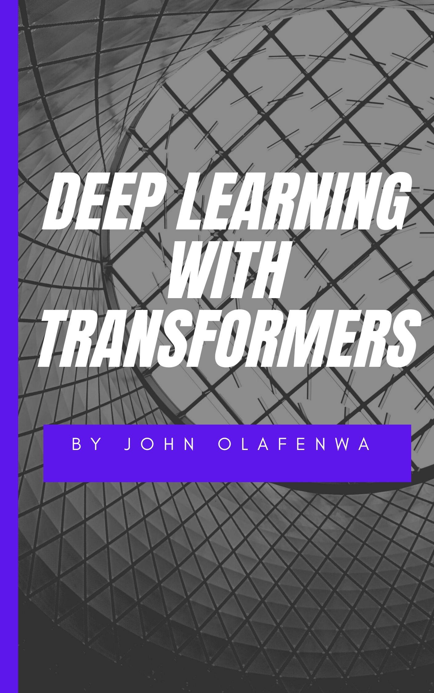

# Deep Learning with Transformers

<figure><figcaption></figcaption></figure>

## PREFACE

In his seminal paper, "Computing Machinery and Intelligence" published in 1950, Alan Turing proposed the famous "Turing Test", the details of the test is quite simple, "A machine is intelligent if it's interaction is indistinguishable from  a human", this entails, when you interact with the machine, it is impossible for you to tell you are not communicating with a human.&#x20;

Turing's work inspired many researchers to pursue the creation of such a system, which ended up being described with the term, "Artificial Intelligence." The existence of this term essentially introduced the concept that intelligence can exist outside of organic systems, this notion that an inorganic system can be programmed to be intelligent, naturally seemed absurd to many people given that it contradicts our everyday experience. Afterall, as a civilization, we have never encountered an intelligence life form that is not organic. The next several decades after Turing's thought provoking paper, AI research ultimately failed to achieve anything close to passing the Turing test, while a lot of progress was made such as the invention of neural networks that are capable of learning any function or algorithm from data, general artificial intelligence capable of understanding very complex interractions, able to recover from mistakes and interract with humans in a way that feels intelligent was out of reach of any artificial intelligence system. The AI systems built pre-GPTs can be described as Task Specific Intelligence rather than General Intelligence.

&#x20;Today, general intelligence systems have become commonplace. Large language models like GPT-4 can answer complex open ended questions, write code, complete software engineering tasks, answer essay questions, and even take exams in ways that often mirror human performance. Today's educators grapple with students using AI to write their essays, and programmers frequently collaborate with AI in pair programming. A parallel trend is seen in the realm of computer vision, where generative models such as Midjourney, Dalle, and Stable Diffusion produce artworks and digital images that rival the clarity of 4K photography.

<figure><figcaption>
Astronaut Feeding chickens (Generated by StableDiffusion)
</figcaption></figure>

_The image illustrates the capabilities of text-to-image generative models. Using the description "Astronaut Feeding Chickens," the stable diffusion model produced an impressively realistic image. Although it took many years to progress from Turing's seminal paper to our current AI advancements, the pace of development has surged notably since 2012._

The history of artificial intelligence can be traced back to many decades ago. Earlier computer scientists tried to develop AI systems capable of human-like vision, speech processing, and text processing. While some of these efforts found success in various applications and industries, AI largely remained a niche field, hampered by its limited capabilities.

However, the landscape began to change in 2012. Alex Krizhevsky, a Ph.D. student at the University of Toronto, introduced an image recognition model named "AlexNet." This model, with its impressive accuracy, sparked a significant shift in artificial intelligence. The success of AlexNet was largely due to Nvidia's high-performance GPUs and the vast amount of data available online, from which the ImageNet dataset was created. At its core, AlexNet utilized a convolutional neural network, drawing inspiration from Yan Lecun's work in 1989.

Seeing the potential of this breakthrough, many companies and academic institutions quickly advanced in the field. The subsequent years saw the introduction of more powerful models, enhanced GPUs from Nvidia, and larger datasets sourced from the internet. Together, these factors led to rapid advancements in areas like object detection, language processing, and speech recognition.

By 2016, a team from Microsoft Research Asia developed an image recognition model called "ResNet" that surpassed human abilities in image classification. Around the same time, significant strides were made in language and speech processing, enhancing tools such as Google Translate and Apple Siri.

Yet, by 2017, while deep learning had become commonplace, it faced notable challenges. Progress seemed to be slowing down; new research works were being published which improved the state of the art, but improvements were often marginal. Expanding datasets or making models bigger no longer yielded significant enhancements. Moreover, these models, while excellent in their specific tasks, struggled with broader applications and could be easily tripped up in real-world scenarios, sometimes with biased outcomes.

In 2017, a new type of neural network was invented, which transformed everything. Ashish Vaswani and his team at Google AI introduced  "Transformers" in their seminal paper, "Attention is All You Need." This new neural network architected completely changed the way we thought about deep learning, moving away from traditional convolutional and recurrent neural networks which had the time were the dominant techniques for building AI systems. Transformers provided a single unified approach for modelling all kinds of data by viewing images, audio, text, 3D data, etc as language.

Presently, the fields of computer vision, language processing, and speech are dominated by transformer-based models. Well-known models like GPT-4, Gemini, LLama, Midjourney, and Stable Diffusion all utilize transformers, bringing us closer to realising Alan Turing's vision for AI.

However, while transformers are powerful and gaining in popularity, there's still a lot to learn about how they work. They are simpler than previous models,  but are relatively new. In this book, we aim to unpack the transformer architecture, providing clear illustrations, code examples, diagrams, and equations, without overwhelming readers with complex math. Intended for both researchers and developers, we will delve into various aspects of transformers, including their optimization, fine-tuning, and applications across different domains.

We hope that this book will help deepen your understanding of the incredible advancements made in AI over the past years.

\

## Table of Contents


[paradigms-of-deep-learning-research.md](paradigms-of-deep-learning-research.md)



[sequence-modelling-with-transformer-encoder.md](sequence-modelling-with-transformer-encoder.md)



[sequence-generation-with-transformer-decoder.md](sequence-generation-with-transformer-decoder.md)



[sequence-to-sequence-generation-with-transformer-encoder-decoder.md](sequence-to-sequence-generation-with-transformer-encoder-decoder.md)



[self-supervised-pretraining-of-transformers.md](self-supervised-pretraining-of-transformers.md)



[speeding-up-transformers.md](speeding-up-transformers.md)



[case-studies-of-transformer-models](case-studies-of-transformer-models/)



[finetuning-large-language-models](finetuning-large-language-models/)



[vision-transformers.md](vision-transformers.md)



[speech-transformers.md](speech-transformers.md)


