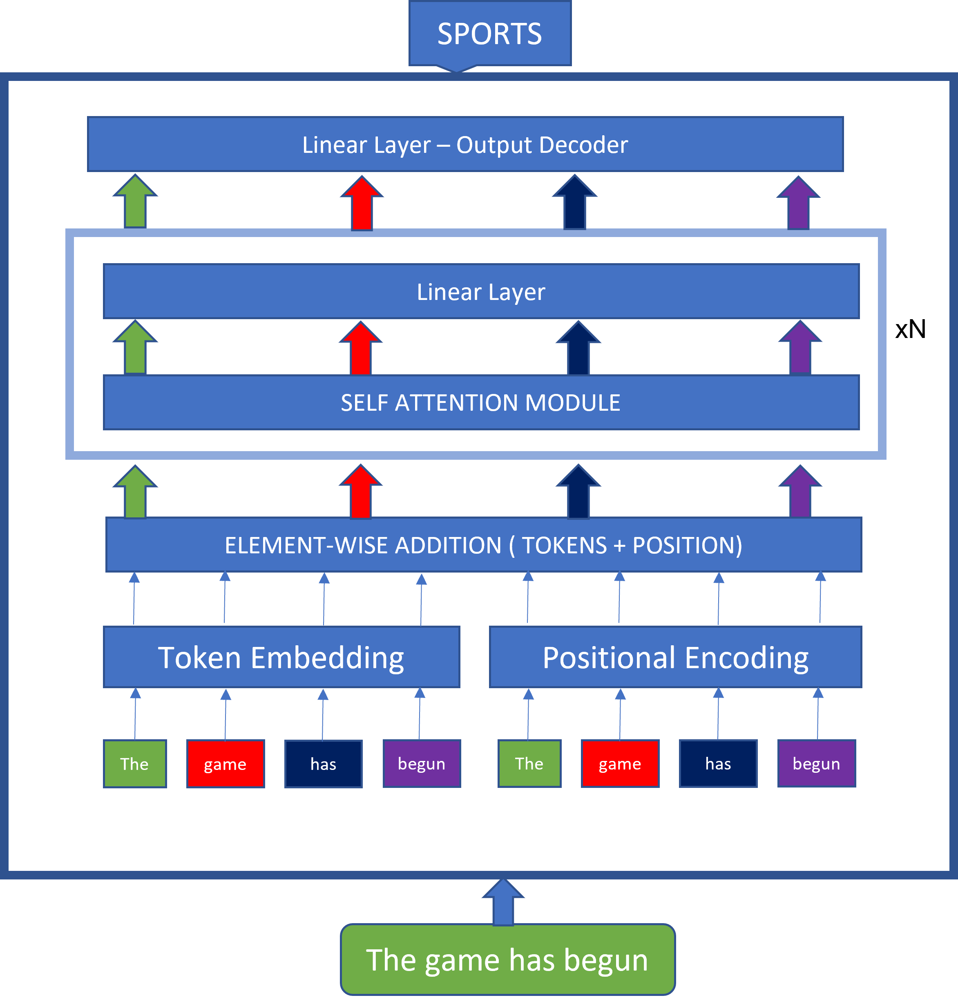
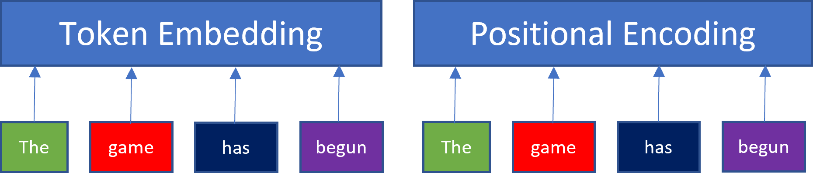
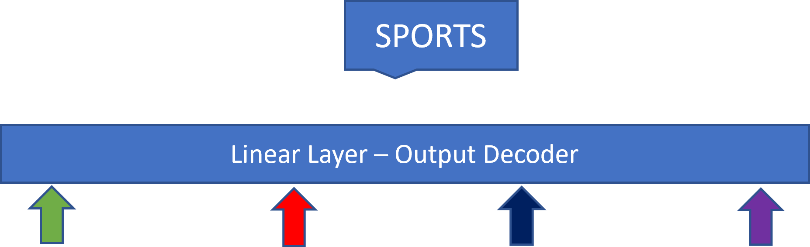
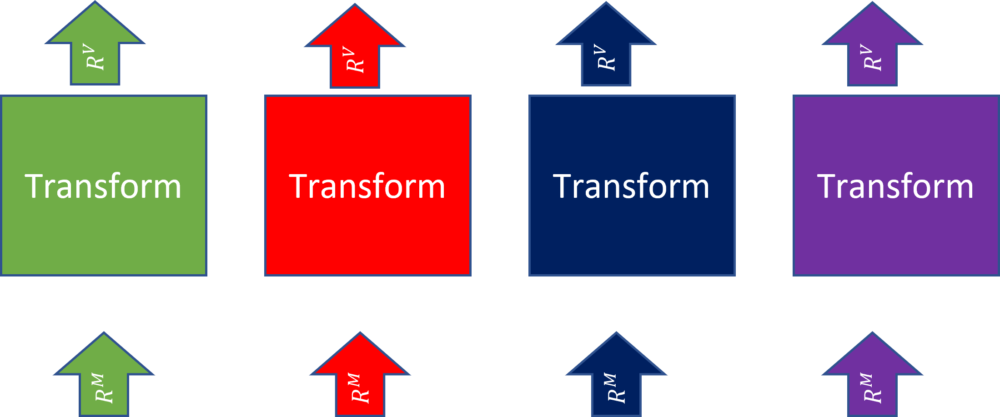
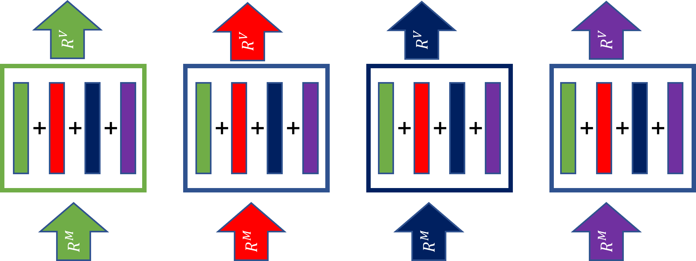
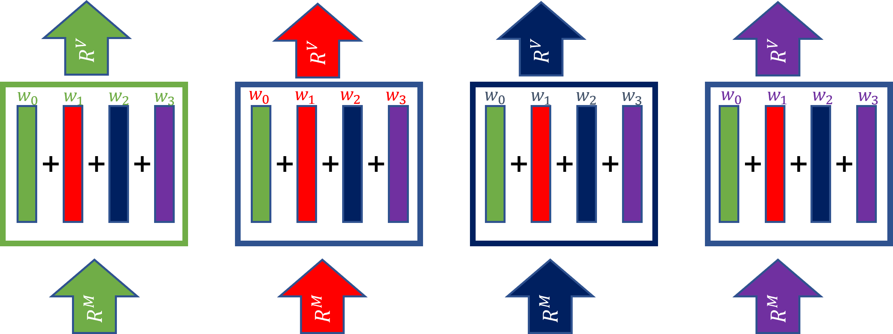

# Transformer Encoder

Transformer encoders are the simplest form of transformer models, they are used for sequence modelling tasks such as text classification, named entity recognition (NER) etc. Sequence modelling tasks with the transformer encoder do not need to be autoregressive or recurrent since we would have access to the entire input needed at the very first step. Also, the order or words in the input would be explicitly modelled using the positional encoding module of the transformer encoder as we shall see in this chapter.

To illustrate further what makes sequence modelling much simple, consider the problem of translating the English sentence, “The game has begun” to French “Le jeu a commence”.

To solve this task, we have the entire English sentence has input and we would translate to French one word at a time. This means, for each word we translate, we must consider not only the whole English sentence, but the French words translated so far. This type of task is handled by a transformer encoder decoder model.

On the other hand , to classify the topic of the sentence “The game has begun”, we simply feed in the entire sentence into the transformer encoder and predict the topic, which in this case could be “sport”

<figure><figcaption>
Figure 4 The words in the input text all travel through the network independently as shown by the color coding, for example, “game” coded red travels through all the paths with red arrows. The only parts of the model where the inputs mix are the self attention module and the output decoder layer, otherwise, they each move through the model from input all the way to the output layer independent of each other.
</figcaption></figure>

Figure 4 above depicts a transformer encoder model that takes in the sentence “the game has begun” and outputs the topic “Sports”.

For simplicity the diagram above omits some internal components, however, this should suffice for us to explain the high level architecture of the transformer decoder, and we shall do this in steps.

&#x20;

**Step 1.**

The input “The game has begun” is broken down into tokens of words, this is called “Tokenization.” We shall explain more about this later in this chapter. Having broken down our single sentence into 4 tokens, each token (word) would then be converted into an integer based on a vocabulary dictionary that maps words to integers and back (more on this later).

So we go from **“The game has begun”** to array **\[The, game, has, begun],** finally after conversion to integers, we would end up with an array of number like, _**\[4, 56, 1, 8].**_

Each of these words would be fed into the model at once as shown in Figure 4, notice how we use color coding to show how each of them travels independently though the network, from the input layers all the way to the final output layer. For example, as we coloured the word “game” with red, every arrow coloured red depicts the flow of the word game through the model.

&#x20;_****_&#x20;

**Step 2:**

With the input in hand, (4 tokens/word represented by 4 numbers), we would feed them into two separate modules side by side, “Token Embedding” and “Positional Encoding Modules”

<figure><figcaption></figcaption></figure>

**Token Embedding**

This module maps tokens from integer scalars to continuous vectors, with the goal of mapping similar tokens to similar vector spaces.

For example, given a vocabulary size of 10 words, and an embedding dimension of 4, the embedding matrix would look like this.

&#x20;

|         | Dim0 | Dim1 | Dim2 | Dim3 |
| ------- | ---- | ---- | ---- | ---- |
| Token 0 |      |      |      |      |
| Token 1 |      |      |      |      |
| Token 2 |      |      |      |      |
| Token 3 |      |      |      |      |
| Token 4 |      |      |      |      |
| Token 5 |      |      |      |      |
| Token 6 |      |      |      |      |
| Token 7 |      |      |      |      |
| Token 8 |      |      |      |      |
| Token 9 |      |      |      |      |

&#x20;

This allows us to pick a token and retrieve the 4 dimensional vector representing it.

After training, you would find that the vectors for words like house and landmark would have higher cosine similarity compared to words like house and mountain which would probably be much distant in their vector representation.

Note, given our 4 integer vector representing our 4 word sentence. If we use an embedding dimension of 512 as is typical in transformer models.

We would transform the input from  $$R^N \to R^{NM}$$​With N = 4 and M = 512.&#x20;

This entails each of our words/token/integer would become a vector of 512 dimensions.

**Positional Encoding**

In a sentence, the order of words matters a lot, if we invert the order of words in the sentence, it might not make sense anymore or mean something else entirely. Therefore, in our transformer model, we need to explicitly model the position of each word in our sentence. This is done with positional encoding, which words very similarly to token embedding.

Let’s see how this works.

Assuming the maximum sequence length we want our model to support is 12, and we choose an embedding dimension of 4 for our positional encoding. We would have a matrix like the one below.

&#x20;

|             | Dim0 | Dim1 | Dim2 | Dim3 |
| ----------- | ---- | ---- | ---- | ---- |
| Position 0  |      |      |      |      |
| Position 1  |      |      |      |      |
| Position 2  |      |      |      |      |
| Position 3  |      |      |      |      |
| Position 4  |      |      |      |      |
| Position 5  |      |      |      |      |
| Position 6  |      |      |      |      |
| Position 7  |      |      |      |      |
| Position 8  |      |      |      |      |
| Position 9  |      |      |      |      |
| Position 10 |      |      |      |      |
| Position 11 |      |      |      |      |

&#x20;

The above allows us to take the index of the position of any word in our input and retrieve a vector representation of that position.

&#x20;

What we do is, the dimension of our token embedding and positional encoding are the same. This gives rise to the logic below.

Given, input tokens T with length N, and embedding dimension M for both the token embedding layer and the positional encoding layer.

Step 1. We feed all the input tokens T into the token embedding layer, transforming the inputs by$$R^N \to R^{NM}$$​

Step 2. We feed all the input tokens T into the positional encoding layer, transforming the inputs by $$R^N \to R^{NM}$$​

Step 3: Perform element wise addition on the outputs from step 1 and step 2,&#x20;

$$
Output^{NM} = Embeddings^{NM} + PositionalEncodings^{NM}
$$

The final output from this step contains not only the embeddings of the tokens but also information about their positions in the sentence.

&#x20;

**Note:** So far, each of the tokens has not interacted with any other token in the sentence, each has been flowing through its own path.

&#x20;

**Step 3**

After we are done with all our embedding activities, we pass the transformed tokens into a stack of “Self Attention + Linear” blocks. As you would see in Figure 6 below.

<figure><figcaption>
Figure 6
</figcaption></figure>

The block shown below is repeated N times as depicted, all of them being identical but without sharing parameters.

First, all the token vectors are passed to the self attention module, as we have earlier explained, this module would compute the outputs of each token as a function of the tokens value as well as the value of the other tokens, however, the contribution of each of the tokens is scaled according to an attention score which would be high for the tokens most important for modelling the current token while the less important ones would have low attention scores. Shortly, we shall speak in more detail about the attention module. As you can note from above, this is the point at which the tokens interact with each other, and compute outputs not just based on their own values but as a weighted sum of the values of the other tokens.

Given each token i, this can be formulated as $$y_i = f(x_i \ | \ x_0, \ ..... \ ,x_{n-1};\theta)$$​

Notice that the number of outputs from this layer is equal to the number of tokens in our input sequence, as each token still continues its journey through the model, however, the dimensionality of each token would change.

The transformation would be $$R^{NM} \to R^{NV}$$ where v is the length of the vector representing each token.

The output from the self attention layer is then passed to a linear layer. At this point, there is no interaction between the tokens as each token is independently passed to the linear layer.

This block is repeated N times, with the output from the previous block being passed as input to the next one.

&#x20;**Step 4**

<figure><figcaption>
<strong>Figure 7</strong>
</figcaption></figure>

The output from the last self attention block is passed to the final linear layer. In this layer, all the values from all the tokens are passed into a single linear layer, hence, the values gets mixed up in a fully connected fashion. This layer would make the final prediction, which in this case is simply to output the classification scores.

## &#x20;Attention in Transformer Encoder

The self attention layer is the perhaps the most important part of the transformer model. To understand what happens here, let us consider first, the input and output. The input as explained earlier is an array of token vectors, each of shape $$R^M$$. Collectively, the input is a matrix $$R^{NM}$$ representing N tokens.

The self attention layer transforms the input to an output of shape $$R^{NV}$$, projecting each token from$$R^M \to R^V$$.

This can be seen as depicted in Figure 8 below.

<figure><figcaption>
Figure 8
</figcaption></figure>

&#x20;Recall, in the self attention layer, we are trying to model the dependencies between the tokens, hence, each  would be constructed from a function that combines the current token with all the other tokens, naively, this can be done as a sum of all the projections from each token as depicted in Figure 9 below.

<figure><figcaption>
Figure 9
</figcaption></figure>

The problem with the above is, all the values from the tokens have equal weight, what we want is, for each current token, we need its output to be a weighted sum of the token and all the other tokens (also called context tokens). Figure 10 below illustrates the weighted version of the above formulation, where for each current token being considered, we have a set of weights $$w_0 \ ... \ w_{n-1}$$called attention weights, that represents how much each of the context tokens contributes to the final output value of the token being processed.

<figure><figcaption>
Figure 10
</figcaption></figure>

The idea here is very simple, the bit of complexity is in how the attention weights are computed.

&#x20;

&#x20;

&#x20;

