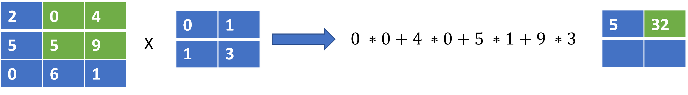
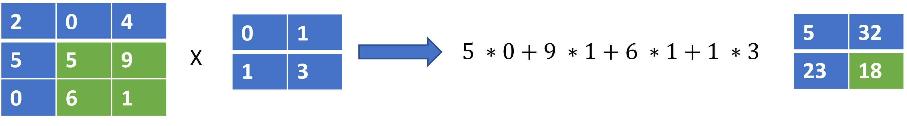

# Paradigms of Deep Learning Research

The quest to build intelligent computer systems has led to the discovery of different techniques for learning from human experiences and passing our knowledge to machines in ways that help them mimic our abilities and perform tasks that were previously impossible. The early days of computing saw the rise of hand-crafted algorithms and classical machine learning techniques such as decision trees and probabilistic models with roots in Bayesian inference. These models worked well on low dimensional data, quickly gaining roots in financial analysis, predictive modelling with tabular and time series data, and other related aspects. However, these methods could not unlock the ability of computers to see, read, hear and speak like humans. Deep Neural Networks unlocked these more advanced capabilities allowing us to create new intelligent systems that have become a normal part of our lives today. Fueled by the abundance of big data and the rapid rise in the compute capability of modern GPUs, the rate of development of the field of deep neural networks has become impossible for anyone to keep pace with. New ground-breaking papers and immeasurable number of applications of them across the world have become normal.

However, despite the large number of techniques, as of today, there are four paradigms of deep learning models under which nearly every new technique falls under. These are;

\-          Feedforward Models

\-          Recurrent Neural Networks

\-          Convolutional Neural Networks

\-          Transformer Models

## Feed Forward Models

<figure><figcaption><p>The first implementation of the perceptron neural network by  <strong>Frank Rosenblatt</strong> in 1958</p></figcaption></figure>

The very first neural network was the perceptron, they are fully connected feedforward neural networks, today they are often named as the Linear or Dense Layer in deep learning frameworks such as PyTorch and Tensorflow . This class of neural network models are universal function approximators. Given sufficient data, they can learn very complex relationships between inputs and outputs in high dimensional spaces. They model the relationship between an input and an output as a function parameterized by a set of weights and biases. In this model, every node in a previous layer is connected to all nodes in the next layer. In Figure 1 below, we show a simple model that takes the relative humidity and temperature and outputs rain or not rain.

<figure><figcaption><p>Figure 1</p></figcaption></figure>

The model depicted above is a two layer fully connected neural network, the middle layer also called the hidden layer has three nodes (h0, h1, h2), the inputs are x0 representing the relative humidity and x1 representing the temperature; both are fed into each of the nodes in the hidden layer. The outputs from each of the hidden layer nodes are all fed into the output layer that gives the likelihood of rain or not rain.

In the simple model, given node $$h_i$$, inputs $$x_j; j \in \{  0\ ...\ m \}$$​and non-linear activation function $$f$$the equation for a node is defined as $$h_i = f(( \sum_{j=0} ^{m-1} w_jx_j ) + b)$$​

In the above, w and b are the learnable parameters of the model, which we derive from training on real world data.

To demystify this further, here is how to compute h0., given humidty = 80 and temperature = 13

$$
h_0 = f(w_{humidity} \ * \ 80 + w_{temperature} \ * \ 13 + b )
$$

In the formulation of the model, the relationship between the inputs and output is defined as

$$
y_i = f(x_i;\theta)
$$

This entails the output of each layer is a linear function of the inputs to it parameterized by  $$\theta$$.&#x20;

As we add more layers of this and introduced activation functions such as Sigmoid or ReLU, the whole network becomes non-linear, able to model any function.

​One thing to note is, the above model does not account for the position of the input features in any way. However, language modelling tasks need to account for the position of inputs. For example, while the sequence "My name is John" makes sense, the reverse, "John is name My" is gibberish.&#x20;

In their simple state, multi layer perceptrons are unable to work for the majority of tasks in language processing and computer vision.


## Recurrent Neural Networks

<figure><figcaption><p>Graphical Illustration of a RNN model</p></figcaption></figure>

Recurrent Neural Networks (RNNs) popularized by the LSTM (Long Short Term Memory) and GRU  (Gated Recurrent Units) variants, developed into a major success. Establishing itself as one of the core paradigms of deep learning research. This class of models contained hidden states that enabled them keep track of long-term dependencies in sequences of inputs. Therefore, they worked well on sequence tasks such as speech and natural language processing.&#x20;

In a RNN, to predict the output **"tomorrow"** from the words **"I am coming  home".** We would do the following:

1\. Feed the first word $$x_0$$ to the  model (e.g "I")

2\. Model returns the next predicted word and first hidden state $$h_0$$​

3\. Feed the second word $$x_1$$ (e.g "am" ) and the first hidden state $$h_0$$ to the model

4\. Model returns the next word and the next hidden state $$h_1$$

5\. Repeat until the last word $$x_{n-1}$$ to get the prediction **"tomorrow"**


If this confuses you, here is the process written in python code


```python
input_data = ["I", "am", "coming", "home"]

# initial hidden state is None
hidden_state = None

# loop over each word and compute a new hidden state and output
for word in input_data:
    output, hidden_state = rnn(word, hidden_state)
    
print(output)
# this should output "tommorow"
```


Mathematically, this can be represented with the equation below.

$$
y_i,h_i = f(x_ih_{i-1})
$$

The above entails the output of each position is a function of the current input and the hidden state computed from the prior input.

In many ways, they are an extension of the standard feedforward neural networks as the components are made up of perceptron modules applied at each time step. The new components are hidden states that help to remember or forget information from the past. While this model worked well, it still had a major flaw, which I shall explain with the example below.

Given an input text such as , “_I am coming home to watch the evening match”_

An RNN allows us to compute the derivations of each of the words based on a hidden state computed from the words that came before it, as the length of the sequence grows longer, some words would become not irrelevant in the computation of future words, hence, the forget gate in an LSTM for example would learn to forget them, however, in reality, some past input not useful at step 4 might become useful at step 10. Therefore, modelling very long-term dependencies effectively with RNNs is hard.

The second problem is that their computation is sequential since each step in the sequence requires a hidden state computed from the previous step. This significantly limits our ability to run them fast enough during training and inference on GPUs which by nature are more suited to parallel operations. These shortcomings motivated the design of transformers which we shall get to soon enough.

## Convolutional Neural Networks

<figure><figcaption><p>Yann Lecun demonstrated image recognition with Convolutional Neural Networks in 1989</p></figcaption></figure>

Convolutional Neural Networks(CNN) were invented by Yann LeCun in the late 1980s. They are a class of neural network models designed to model the grid-like structure of images by learning image kernels applied on image data in a sliding window fashion.

CNN models became the bedrock of computer vision and is still very much in vogue. They have since been largely applied to model speech and text as well.

&#x20;While they are often applied in a single-shot fashion to model images frame-by-frame, different formulations such as causal convolutions allow modelling sequences such as text and speech in an auto-regressive manner. Besides being the de-facto model for image modelling, image generation, and video understanding they have been successfully applied to language translation as well.

In Figure 3 below, we show a basic CNN model that takes in the image of a cat and via a couple of convolution layers and a linear layer with softmax, is able to classify if the image is that of a cat.


<figure><figcaption><p>Figure 3</p></figcaption></figure>

As we earlier mentioned, CNN modules learn image filters useful to perform a task given an image. The way this works can be illustrated below by considering how a single  2 \* 2 filter is applied to a 3 \* 3 image to produce an output.

<figure><figcaption></figcaption></figure>

Step 1

<figure><figcaption></figcaption></figure>

Step 2

<figure><figcaption></figcaption></figure>

Step 3

<figure><figcaption></figcaption></figure>

Step 4

<figure><figcaption></figcaption></figure>

Above, we compute a dot product of the 2 \* 2 filter with a 2 \* 2 region of the image, moving window by window as shown  by the green coloured section at each step.

Note that, while the output above is also a 2 \* 2 grid of numbers, the size of the output would often be very different from the size of the filter.

In practice, all the steps above would be done in parallel and multiple filters would be used. But the above simple example, shows at its core, how cnn models apply filters learned from real data to model images,

Some of the advantages of CNNs are their parallel nature, computational efficiency and simplicity.\


## Transformer Models

Until 2017, the three paradigms as highlighted above were the dominant class of deep learning models used for everything AI from images to text and speech. Convolutional neural networks were used primarily for computer vision, recurrent neural networks primarily for text and speech sequence modelling while feedforward models were either used for basic regression problems or as components of CNNs and RNNs.&#x20;

In 2017, Vaswani et al published the ground-breaking paper titled, “_Attention is all You Need”_ . Therefore, the 4th paradigm of deep learning architectures was born.

These new models were called transformers and have since evolved in different ways achieving state of the art results on nearly every task across computer vision, natural language processing, speech processing, and reinforcement learning. Beyond achieving SOTA results across these tasks, they have opened new frontiers in our ability to scale deep learning models, build single models that can perform multiple tasks and achieve results that were previously impossible. Therefore, we shall spend the rest of this book learning what transformers are, how they work, and how to train and deploy them.

At their core, transformers are made up of three major components, standard linear layers, a positional encoder layer and the Attention modules that model the dependency between each word in a sequence and all other words in the sequence in a parallel fashion without needing to maintain a hidden state.

Before diving into the details of this really means, lets consider the type of problems we are trying to solve in natural language processing. Typical NLP tasks including translating a sentence from one language to another (e.g english to yoruba), classifying the sentiment of a tweet, summarizing a sentence, predicting the parts of speech of words in a sentence or maybe doing named entity recognition (e.g which words refers to entities like people or organizations). In all of this, two things are really important;&#x20;

First, the position of words relative to each other matters absolutely. For example, the sequence, "Have you eaten the food" is a question, however "The food you have eaten" is a noun phrase. These two sequences are composed with the exact same words but the difference in their meaning is entirely derived on the position of the words. Changing the order of words in any sentence often changes is meaning. Recurrent neural networks deals with this by using a loop to process words position by position and passing a hidden state from the previous positions to the next. Transformers solve this by explicitly encoding the position of each word in the sentence as a vector. In this sense, transformers not only learn the value of a word but conditions that value on what position in the sentence the word occured. One key advantage of this over the recurrent approach is that the position of every word in the sequence can be encoded in parallel rather than sequentially.

This can be illustrated with the pytorch example below

```python
import torch.nn as nn
# Input text
input_data = ["I", "am", "coming", "home"]

# Array of positions
positions = torch.tensor([0, 1, 2, 3])

# Create an embedding layer to encode positions
positional_encoder = nn.Embedding(num_embeddings=4, embedding_dim=32)

# embed the position of each word into a vector of 32 dimensions
position_embeddings = positional_encoder(positions)

print(position_embeddings.shape)
# outputs [4, 32]
```

As seen in the example above, we create a pytorch embedding module to explicity encode the position of each word into some N dimentional vector. By doing this, we entirely eliminate the need to process each word with a loop as done in reccurent neural networks.


The second component and perhaps the most important is the Attention layer. This layer learns to encode the value of each word as a function of the word itself as well as all other words in the sequence. If you think about it, this actually makes sense. Looking at a word in isolation does not tell us a lot about its meaning without looking at the entire sequence in which it is found. The same word can be either offensive, positive, negative or neutral depending on the other words that came before or after it. This basic intuition is the motivation behind the design of the attention layer.

To get a good idea for how this is implement, lets consider some code examples.

In the example below, we are going to pick a word from a sequence and encode it using the traditional linear layer. No attention mechanism of any kind would be applied.

```python
# Normal encoding of one word
input_data = ["I", "am", "coming", "home"]

# encode "coming"
value = encode("coming")
```

In the above, we pick the word "coming" and we use an arbitary encoding function named "encode" to transform the word into some desired output,&#x20;

Now, with attention, we aim to do the following instead.

```python
# Encoding of one word using Attention

input_data = ["I", "am", "coming", "home"]

# encode values of every word
value_coming = encode("coming")
value_I = encode("I")
value_am = encode("am")
value_home = encoder("home")

# weight of the values of each word

W_coming = 0.6
W_I = 0.1
W_am = 0.1
W_home = 0.2

# Compute the final value of the word "coming" as a weighted sum of the valus of all the words
final_value_of_coming = (W_coming * value_coming) + (W_I * value_I) + (W_am * value_am) + (W_home * value_home) 
```

The above code verbosely illustrates how attention works. Remmeber all we are try to learn above is some encoding of the word "coming", to do this. We followed the steps below.

1. We encode every single word in the sequence into the same output dimension.
2. We store a weight W for every single word, for example, W\_I as the weight for word I. The values of the weights tells us how important each of this words is to encoding the word "coming". For example, unsurprisingly the word "coming" itself carries the highest importance with W\_coming being 0.6, while W\_home is the second most important with a value of 0.2, the two other words carry less importance in determining the encoding of "coming", hence, their values are small.
3. We multiply each word by its weight and sum up everything together.
4. The output of the sum above is the value of the word "coming" with different degrees of influence contributed by the other words in order of their weight values.
5. Repeat the process for all the other words

The above encapsulates the core of how transformers work. However, unlike the way we explictly encode values for W\_coming, W\_I, W\_am e.t.c, the process of computing this weights is slightly more involved.  The example given above is just an illustration.

In the next chapter, we shall discuss how to design transformer architectures in a very efficient and simple manner.
