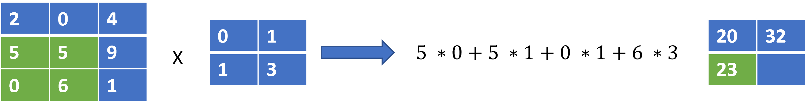

# Paradigms of Deep Learning Research

The quest to build intelligent computer systems has led to the discovery of different techniques for learning from human experiences and passing our knowledge to machines in ways that help them mimic our abilities and perform tasks that were previously impossible. The early days of computing saw the rise of hand-crafted algorithms and classical machine learning techniques such as decision trees and probabilistic models with roots in Bayesian inference. These models worked well on low dimensional data, quickly gaining roots in financial analysis, predictive modelling with tabular and time series data, and other related aspects. However, these methods could not unlock the ability of computers to see, read, hear and speak like humans. Deep Neural Networks unlocked these more advanced capabilities allowing us to create new intelligent systems that have become a normal part of our lives today. Fueled by the abundance of big data and the rapid rise in the compute capability of modern GPUs, the rate of development of the field of deep neural networks has become impossible for anyone to keep pace with. New ground-breaking papers and immeasurable number of applications of them across the world have become normal.

However, despite the large number of techniques, as of today, there are four paradigms of deep learning models under which nearly every new technique falls under. These are;

\-          Feedforward Models

\-          Recurrent Neural Networks

\-          Convolutional Neural Networks

\-          Transformer Models

## Feed Forward Models

<figure><figcaption><p>The first implementation of the perceptron neural network by  <strong>Frank Rosenblatt</strong> in 1958</p></figcaption></figure>

The very first neural network was the perceptron, they are fully connected feedforward neural networks, today they are often named as the Linear or Dense Layer in deep learning frameworks such as PyTorch and Tensorflow . This class of neural network models are universal function approximators. Given sufficient data, they can learn very complex relationships between inputs and outputs in high dimensional spaces. They model the relationship between an input and an output as a function parameterized by a set of weights and biases. In this model, every node in a previous layer is connected to all nodes in the next layer. In Figure 1 below, we show a simple model that takes the relative humidity and temperature and outputs rain or not rain.

<figure><figcaption><p>Figure 1</p></figcaption></figure>

The model depicted above is a two layer fully connected neural network, the middle layer also called the hidden layer has three nodes (h0, h1, h2), the inputs are x0 representing the relative humidity and x1 representing the temperature; both are fed into each of the nodes in the hidden layer. The outputs from each of the hidden layer nodes are all fed into the output layer that gives the likelihood of rain or not rain.

In the simple model, given node $$h_i$$, inputs $$x_j; j \in \{  0\ ...\ m \}$$​and non-linear activation function $$f$$the equation for a node is defined as $$h_i = f(( \sum_{j=0} ^{m-1} w_jx_j ) + b)$$​

In the above, w and b are the learnable parameters of the model, which we derive from training on real world data.

To demystify this further, here is how to compute h0.

$$
h_0 = f(w_0 \ * \ 80 + w_1 \ * \ 13 + b )
$$

In the formulation of the model, the relationship between the inputs and output is defined as

$$
y_i = f(x_i;\theta)
$$

​A key thing to note about this formulation is that it doesn’t allow for modelling dependencies between different positions in a sequence, each input is modelled independently. This made it unsuitable for problems such as language translation and speech modelling where the relationship between different positions in the sequence is important.

When applied to simple problems, this model worked great, however, they often overfitted to training data and could not work well on more complex problems such as classifying images. Therefore, neural networks became unpopular and their failure to work well led to the AI winter  of the 1990s.

***

## Recurrent Neural Networks

<figure><figcaption><p>Graphical Illustration of a RNN model</p></figcaption></figure>

Recurrent Neural Networks (RNNs) popularized by the LSTM (Long Short Term Memory) and GRU  (Gated Recurrent Units) variants, developed into a major success. Establishing itself as one of the core paradigms of deep learning research. This class of models contained hidden states that enabled them keep track of long-term dependencies in sequences of inputs. Therefore, they worked well on sequence tasks such as speech and natural language processing.&#x20;

In a RNN, to predict the output **"tomorrow"** from the words **"I am coming  home".** We would do the following:

1\. Feed the first word $$x_0$$ to the  model (e.g "I")

2\. Model returns the next predicted word and first hidden state $$h_0$$​

3\. Feed the second word $$x_1$$ (e.g "am" ) and the first hidden state $$h_0$$ to the model

4\. Model returns the next word and the next hidden state $$h_1$$

5\. Repeat until the last word $$x_{n-1}$$ to get the prediction **"tomorrow"**

****

If this confuses you, here is the process written in python code


```python
input_data = ["I", "am", "coming", "home"]

# initial hidden state is None
hidden_state = None

# loop over each word and compute a new hidden state and output
for word in input_data:
    output, hidden_state = rnn(word, hidden_state)
    
print(output)
// this should output "tommorow"
```


Mathematically, this can be represented with the equation below.

$$
y_i,h_i = f(x_ih_{i-1})
$$

In many ways, they are an extension of the standard feedforward neural networks as the components are made up of standard perceptron modules applied at each time step. The new components are hidden states that help to remember or forget information from the past. While this model worked well, it still had a major flaw, which I shall explain with the example below.

Given an input text such as , “_I am coming home to watch the evening match”_

An RNN allows us to compute the derivations of each of the words on a hidden state computed from the words that came before it, as the length of the sequence grows longer, some words would become irrelevant to compute some future words, hence, the forget gate in an LSTM for example would learn to forget them, however, in reality, some past input not useful at step 4 might become useful at step 10. Therefore, modelling very long-term dependencies effectively with RNNs is hard.

The second problem is that their computation is sequential since each step in the sequence requires a hidden state computed from the previous step. This significantly limits our ability to run them fast enough during training and inference on GPUs which by nature are more suited to parallel operations. These shortcomings motivated the design of transformers which we shall get to soon enough.


## Convolutional Neural Networks

Convolutional Neural Networks(CNN) were invented by Yann LeCun in the late 1990s, just around the same time as the LSTM. They are a class of neural network models designed to model the grid-like structure of images by learning image kernels applied on image data in a sliding window fashion.

CNN models became the bedrock of computer vision and is still very much in vogue. They have since been largely applied to model speech and text as well.

&#x20;While they are often applied in a single-shot fashion to model images frame-by-frame, different formulations such as causal convolutions allow modelling sequences such as text and speech in an auto-regressive manner. Besides being the de-facto model for image modelling, image generation, and video understanding they have been successfully applied to language translation as well.

In Figure 3 below, we show a basic CNN model that takes in the image of a cat and via a couple of convolution layers and a linear layer with softmax, is able to classify if the image is that of a cat.


<figure><figcaption><p>Figure 3</p></figcaption></figure>

As we earlier mentioned, CNN modules learn image filters useful to perform a task given an image. The way this works can be illustrated below by considering how a single  2 \* 2 filter is applied to a 3 \* 3 image to produce an output.

<figure><figcaption></figcaption></figure>

Step 1

<figure><figcaption></figcaption></figure>

Step 2

<figure><figcaption></figcaption></figure>

Step 3

<figure><figcaption></figcaption></figure>

Step 4

<figure><figcaption></figcaption></figure>

Above, we compute a dot product of the 2 \* 2 filter with a 2 \* 2 region of the image, moving window by window as shown  by the green coloured section at each step.

Note that, while the output above is also a 2 \* 2 grid of numbers, the size of the output would often be very different from the size of the filter.

In practice, all the steps above would be done in parallel and multiple filters would be used. But the above simple example, shows at its core, how cnn models apply filters learned from real data to model images,

Some of the advantages of CNNs are their parallel nature, computational efficiency and simplicity.\


## Transformer Models

Until 2017, the three paradigms as highlighted above were Feedforward Networks which were used for very simple modelling tasks and as components of both convolutional neural networks and recurrent neural networks. And as earlier mentioned, convolutional neural networks were used primarily for computer vision and recurrent neural networks primarily for text and speech sequence modelling. All deep learning methods were based on these three paradigms.

In 2017, Vaswani et al published the ground-breaking paper, “_Attention is all You Need”_ , that brought the 4th paradigm of deep learning architectures.

These new models were called transformers and have since evolved in different ways achieving state of the art results on nearly every\
&#x20;task across computer vision, natural language processing, speech processing, and reinforcement learning. Beyond achieving SOTA results across these tasks, they have opened new frontiers in our ability to scale deep learning models, build single models that can perform multiple tasks\[ii] and achieve results that were previously impossible. Therefore, we shall spend the rest of this book learning what transformers are, how they work, and how to train and deploy them.

At their core, transformers are made up of three major components, standard linear modules, a positional encoder module and the Attention modules that model the dependency between each position in a sequence and all other dependencies in the sequence in a parallel fashion without needing to maintain a hidden state. More importantly, for each input, it can learn how important each of the other inputs are to model it. For example, in order to predict the next word in the sequence “_I am coming home to watch the evening match”_ given the input “_I am coming home to watch the evening”,_ the attention module enables the module to learn that value of the word “_watch”_ should be given more importance in order to predict the target word _“match”_ more than the word _“the”._ This is an arbitrary example that illustrates just how the attention module learns which inputs are useful and related to performing a task.

In simple terms, the attention module helps the model learn to focus.

As humans, we do this all the time. For instance, when I go into the kitchen to prepare tea, I would likely pay more attention to the part of the kitchen where the kettle is located as compared to the part of the kitchen where the fridge is located. Such focus helps us to solve problems efficiently, enabling us to focus less on parts of our environments that are not immediately useful to what we are doing at a point in time, albeit without completely disregarding the other aspects of our environment, helping us to use information from them as necessary. This simple concept is what the authors of the transformer paper used to lay the foundation for the next evolution of deep learning research.

Unlike RNNs , transformer models do not have the forgetting problem.

The formulation of transformer models can be represented by the equation for autoregressive models

$$
y_i = f(x_i \ | \ x_0, \ ..... \ ,x_{i-1};\theta)
$$

Furthermore, in non-casual settings (e.g sequence classification), each data point can depend not only on the past but can also depend on future data points, giving rise to the following equation:

$$
y_i = f(x_i \ | \ x_0, \ ..... \ ,x_{n-1};\theta)
$$

If the above isn’t super clear, don’t worry, we shall explain how transformers works in clearer detail in the next chapter with emphasis on the structure of the architecture and the attention module.


&#x20;

