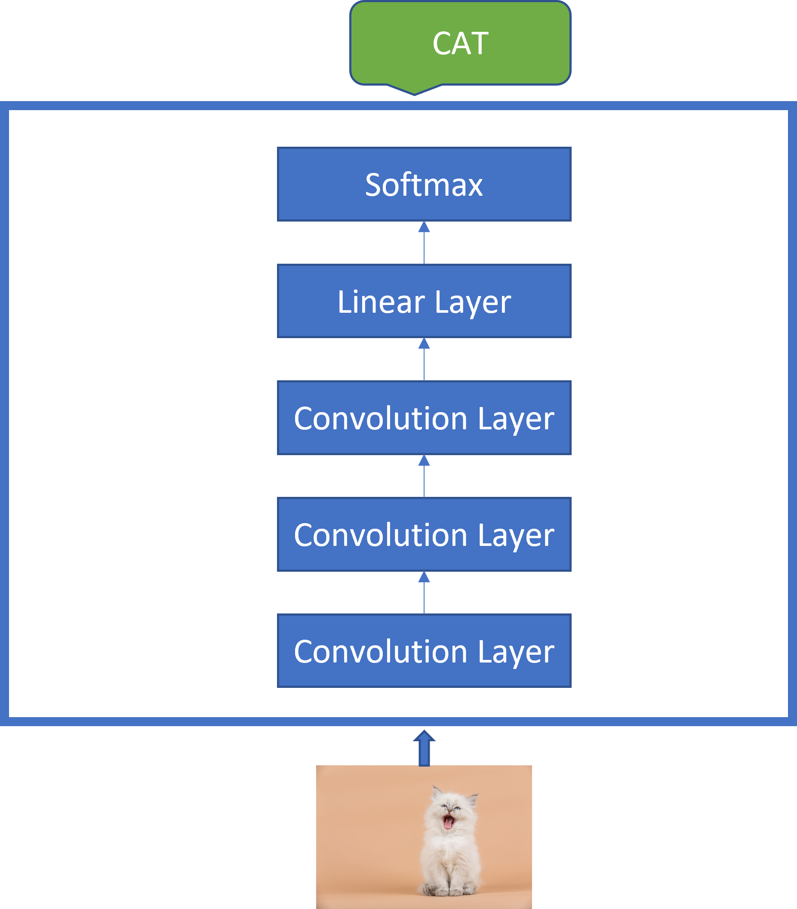
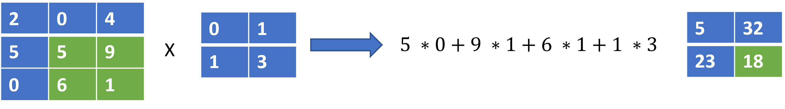
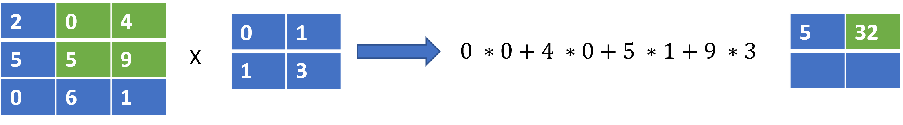
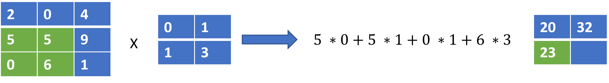

# Convolutional Neural Networks

Convolutional Neural Networks(CNN)\[i] were invented by Yann LeCun in the late 1990s, just around the same time as the LSTM\[JO1] . They are a class of neural network models designed to model the grid-like structure of images by learning image kernels applied on image data in a sliding window fashion.

CNN models became the bedrock of computer vision and still rule till date. They have since been largely applied to model speech and text as well.

&#x20;While they are often applied in a single-shot fashion to model images

frame-by-frame, different formulations such as causal convolutions allow modelling sequences such as text and speech in an auto-regressive manner. Besides being the de-facto model for image modelling, image generation, and video understanding they have been successfully applied to language translation as well.\[ii]

In Figure 3 below, we show a basic CNN model that takes in the image of a cat and via a couple of convolution layers and a linear layer with softmax, is able to classify if the image is that of a cat.

<figure><figcaption>
Figure 3
</figcaption></figure>

As we earlier mentioned, CNN modules learn image filters useful to perform a task given an image. The way this works can be illustrated below by considering how a single  2 \* 2 filter is applied to a 3 \* 3 image to produce an output.

<figure><figcaption></figcaption></figure>

Step 1

<figure><figcaption></figcaption></figure>

Step 2

<figure><figcaption></figcaption></figure>

Step 3

<figure><figcaption></figcaption></figure>

Step 4

<figure><figcaption></figcaption></figure>

Above, we compute a dot product of the 2 \* 2 filter with a 2 \* 2 region of the image, moving window by window as shown  by the green coloured section at each step.

Note that, while the output above is also a 2 \* 2 grid of numbers, the size of the output would often be very different from the size of the filter.

In practice, all the steps above would be done in parallel and multiple filters would be used. But the above simple example, shows at its core, how cnn models apply filters learned from real data to model images,

Some of the advantages of CNNs are their parallel nature, computation efficiency and simplicity.\

***

\[i] Lecun, Y.; Bottou, L.; Bengio, Y.; Haffner, P. (1998). "Gradient-based learning applied to document recognition" (PDF). Proceedings of the IEEE. 86 (11): 2278–2324. doi:10.1109/5.726791.

&#x20;

\[ii] Convolutional Sequence to Sequence Learning [https://arxiv.org/abs/1705.03122](https://arxiv.org/abs/1705.03122)

