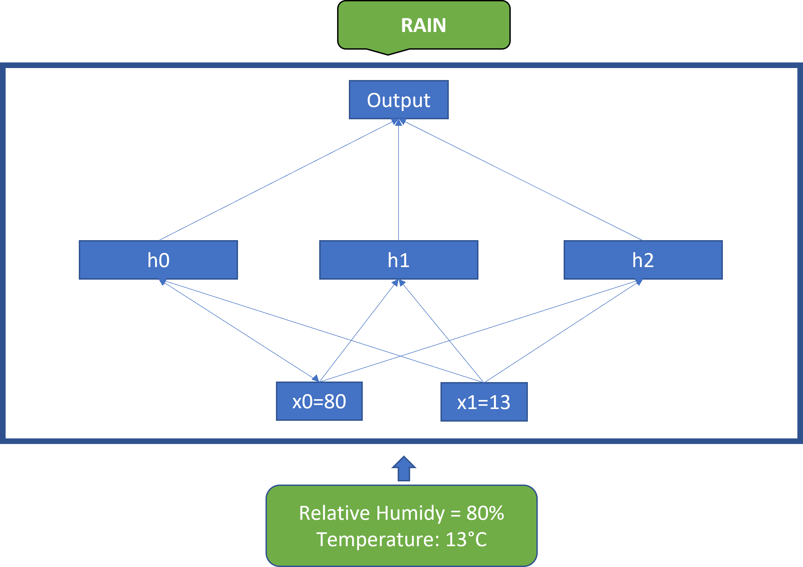

# Perceptron Based Feedforward Models

The first paradigm of Deep Learning models was the perceptron, they are fully connected feedforward neural networks\[i], today they are often named as the Linear or Dense Layer in deep learning frameworks such as PyTorch and Tensorflow . This class of neural network models are universal function approximators. Given sufficient data, they can learn very complex relationships between inputs and outputs in high dimensional spaces. They model the relationship between an input and an output as a function parameterized by a set of weights and biases. In this model, every node in a previous layer is connected to all nodes in the next layer. In Figure 1 below, we show a simple model that takes the relative humidity and temperature and outputs rain or not rain.

<figure><figcaption>
Figure 1
</figcaption></figure>

The model depicted above is a two layer fully connected neural network, the middle layer also called the hidden layer has three nodes (h0, h1, h2), the inputs are x0 representing the relative humidity and x1 representing the temperature; both are fed into each of the nodes in the hidden layer. The outputs from each of the hidden layer nodes are all fed into the output layer that gives the likelihood of rain or not rain.

In the simple model, given node $$h_i$$, inputs $$x_j; j \in \{  0\ ...\ m \}$$​and non-linear activation function $$f$$the equation for a node is defined as $$h_i = f(( \sum_{j=0} ^{m-1} w_jx_j ) + b)$$​

In the above, w and b are the learnable parameters of the model, which we derive from training on real world data.

To demystify this further, here is how to compute h0.

$$
h_0 = f(w_0 \ * \ 80 + w_1 \ * \ 13 + b )
$$

In the formulation of the model, the relationship between the inputs and output is defined as

$$
y_i = f(x_i;\theta)
$$

​A key thing to note about this formulation is that it doesn’t allow for modelling dependencies between different positions in a sequence, each input is modelled independently. This made it unsuitable for problems such as language translation and speech modelling where the relationship between different positions in the sequence is important.

When applied to simple problems, this model worked great, however, they often overfitted to training data and could not work well on more complex problems such as classifying images. Therefore, neural networks \[JO1] became unpopular and their failure to work well led to the AI winter \[JO2] of the 1990s.

***

&#x20;\[JO1]Make reference to the specific type of neural network here.

&#x20;\[JO2]Add reference to AI winter here

***

\[i] Rosenblatt, Frank (1958), The Perceptron: A Probabilistic Model for Information Storage and Organization in the Brain, Cornell Aeronautical Laboratory, Psychological Review, v65, No. 6, pp. 386–408. doi:10.1037/h0042519.

&#x20;
