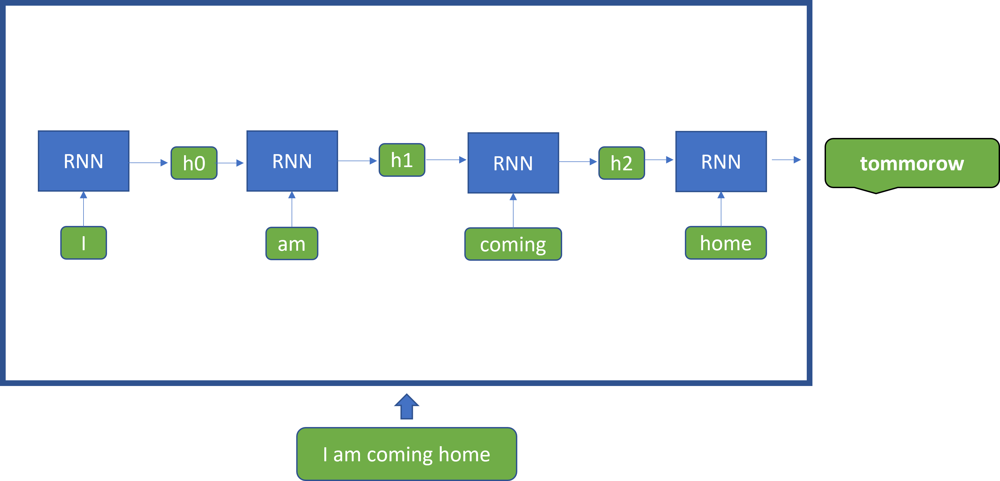

# Recurrent Neural Networks

Recurrent Neural Networks (RNNs) popularized by the LSTM\[JO1] (Long Short Term Memory)\[i] and GRU\[JO2]  (Gated Recurrent Units)\[ii] variants, developed into a major success. Establishing itself as one of the core paradigms of deep learning research. This class of models contained hidden states that enabled them keep track of long-term dependencies in sequences of inputs. Therefore, they worked well on sequence tasks such as speech and natural language processing. The way they work is to model the relationship between the input and output as

$$
y_i,h_i = f(x_ih_{i-1})
$$

In simple terms, this means:

1\.    Feed an input $$x_0$$ into the model

2\.    Model returns outputs $$y_0$$and hidden state $$h_0$$​

3\.     For the next prediction, feed the model input $$x_1$$ and previous hidden state  $$h_0$$

Figure 2 below is a simplified illustration on a RNN, depicting a task of predicting the next word (“tomorrow”) from a history of past words (“I am coming home”)

<figure><figcaption>
Figure 2
</figcaption></figure>

In many ways, they are an extension of the standard feedforward neural networks as the components are made up of standard perceptron modules applied at each time step. The new components are hidden states that help to remember or forget information from the past. While this model worked well, it still had a major flaw, which I shall explain with the example below.

Given an input text such as , “_I am coming home to watch the evening match”_

An RNN allows us to compute the derivations of each of the words on a hidden state computed from the words that came before it, as the length of the sequence grows longer, some words would become irrelevant to compute some future words, hence, the forget gate in an LSTM for example would learn to forget them, however, in reality, some past input not useful at step 4 might become useful at step 10. Therefore, modelling very long-term dependencies effectively with RNNs is hard.

The second problem is that their computation is sequential since each step in the sequence requires a hidden state computed from the previous step. This significantly limits our ability to run them fast enough during training and inference on GPUs which by nature are more suited to parallel operations. These shortcomings motivated the design of transformers which we shall get to soon enough.

\[i] Sepp Hochreiter; Jürgen Schmidhuber (1997). "Long short-term memory". Neural Computation. 9 (8): 1735–1780. doi:10.1162/neco.1997.9.8.1735. PMID 9377276. S2CID 1915014.

&#x20;

\[ii] Cho, Kyunghyun; van Merrienboer, Bart; Bahdanau, DZmitry; Bengio, Yoshua (2014). "On the Properties of Neural Machine Translation: Encoder-Decoder Approaches". arXiv:1409.1259.

&#x20;

***

&#x20;\[JO1]Insert full meaning of the term

&#x20;\[JO2]Insert full meaning of the term
